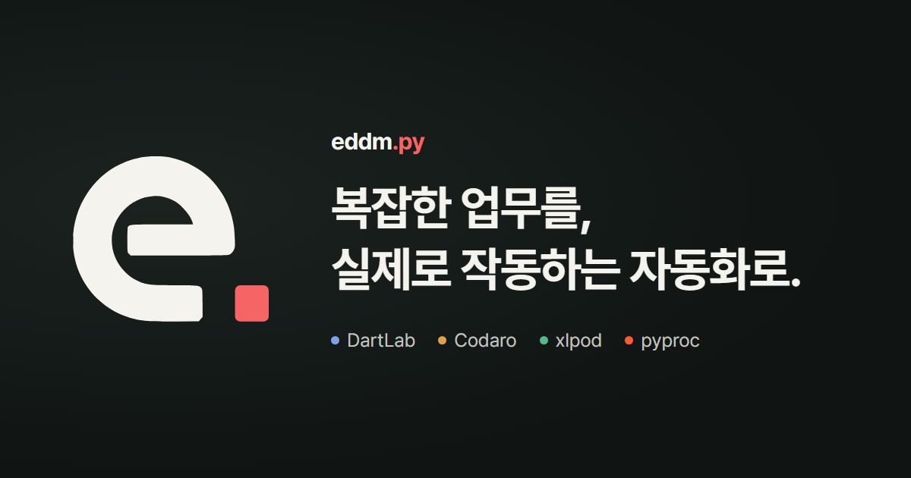
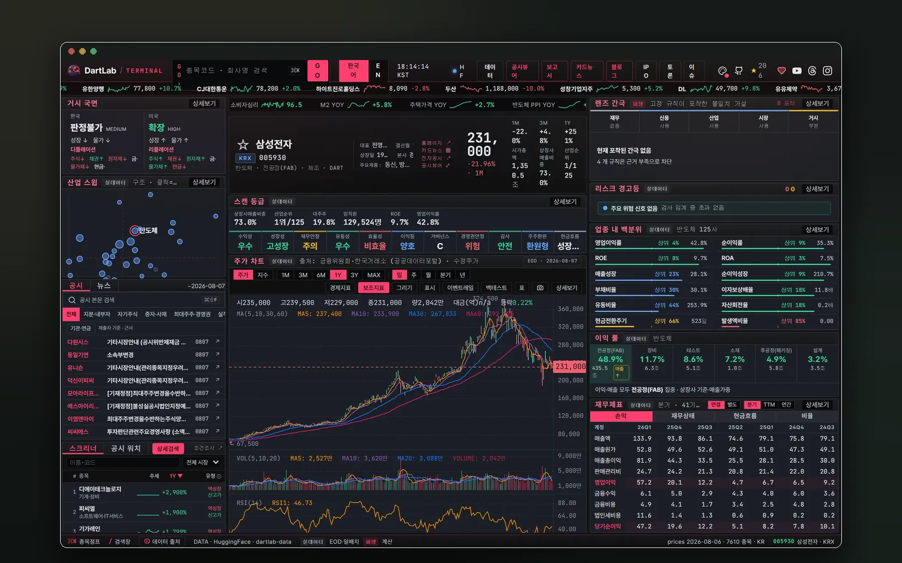
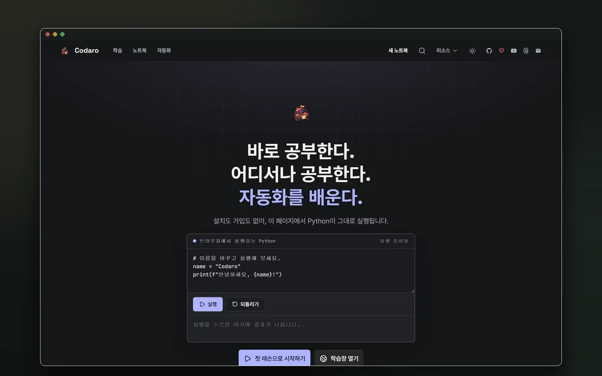
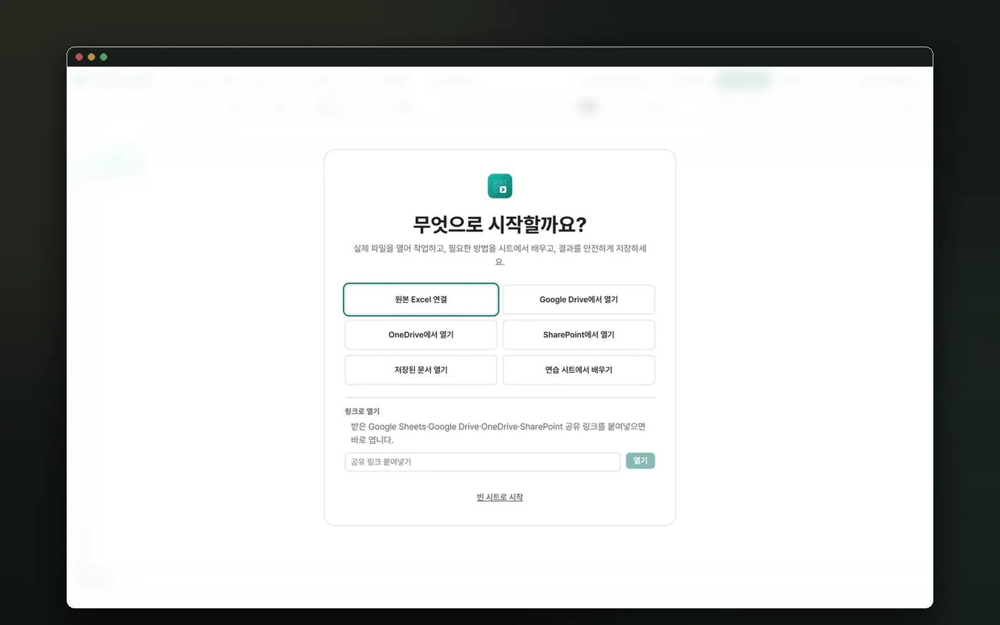
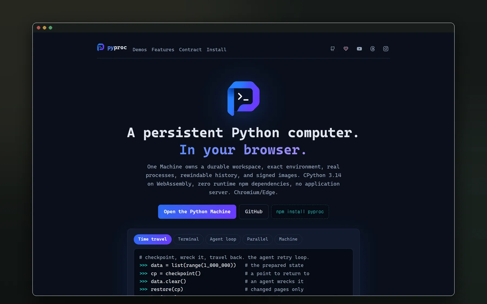

<p align="center">
  <a href="https://eddmpython.com">
    
  </a>
</p>

<h1 align="center">eddmpython</h1>

<p align="center">
  <a href="https://eddmpython.com">
    
  </a>
</p>

<p align="center">
  Python과 AI로 재무, 데이터, 반복 업무를 분석하고<br />
  다시 실행할 수 있는 제품으로 만듭니다.
</p>

<p align="center">
  <strong><a href="https://eddmpython.com">제품 둘러보기</a></strong>
  &nbsp;·&nbsp;
  <a href="https://eddmpython.com/blog">만들면서 배운 것 읽기</a>
  &nbsp;·&nbsp;
  <a href="https://www.youtube.com/@eddmpython">YouTube</a>
  &nbsp;·&nbsp;
  <a href="https://www.threads.com/@eddmpython">Threads</a>
</p>

## 안녕하세요, 으뜸이입니다

으뜸이를 캐릭터화한 분홍 뱀입니다. 낯선 데이터와 도구를 조금 더 가깝게 설명하려고 GitHub, Threads, YouTube의 아바타와 콘텐츠에 다양한 포즈로 등장합니다.

<p align="center">
  
</p>

<table>
  <tr>
    <td width="33.33%" align="center" valign="top">
      <a href="https://www.threads.com/@eddmpython">
        
      </a>
      <br /><strong>반갑게 인사하고</strong><br /><sub>Threads</sub>
    </td>
    <td width="33.33%" align="center" valign="top">
      <a href="https://www.youtube.com/@eddmpython">
        
      </a>
      <br /><strong>데이터를 들여다보고</strong><br /><sub>YouTube</sub>
    </td>
    <td width="33.33%" align="center" valign="top">
      <a href="https://github.com/eddmpython">
        
      </a>
      <br /><strong>작동하는 것을 만들어요</strong><br /><sub>GitHub</sub>
    </td>
  </tr>
</table>

## 지금 바로 써보는 제품

<table>
  <tr>
    <td width="50%" valign="top">
      <a href="https://eddmpython.github.io/dartlab/">
        
      </a>
      <h3>DartLab</h3>
      <p><strong>종목코드 하나. 기업의 전체 이야기.</strong></p>
      <p>한국 DART와 미국 SEC EDGAR 공시를 Python 한 줄로 읽고 비교합니다. 재무제표부터 2,664개 상장사 스캔과 34개 산업 지도까지 같은 문법으로 이어집니다.</p>
      <p><a href="https://eddmpython.github.io/dartlab/"><strong>문서 보기</strong></a> · <a href="https://pypi.org/project/dartlab/">PyPI</a> · <a href="https://github.com/eddmpython/dartlab">GitHub</a></p>
    </td>
    <td width="50%" valign="top">
      <a href="https://eddmpython.github.io/codaro/">
        
      </a>
      <h3>Codaro</h3>
      <p><strong>다운로드 없이 시작하는 Python 학습.</strong></p>
      <p>설치도 가입도 없이 브라우저에서 배우고, 고치고, 바로 실행합니다. 남길 결과를 기준으로 짠 472개 레슨은 실제 파일과 자동화를 다루는 Local 스튜디오로 이어집니다.</p>
      <p><a href="https://eddmpython.github.io/codaro/"><strong>Web Learn 열기</strong></a> · <a href="https://github.com/eddmpython/codaro/releases/latest">Windows 런처</a> · <a href="https://github.com/eddmpython/codaro">GitHub</a></p>
    </td>
  </tr>
  <tr>
    <td width="50%" valign="top">
      <a href="https://xlpod.eddmpython.com/">
        
      </a>
      <h3>xlpod</h3>
      <p><strong>셀 수식 안에서 진짜 Python이 도는 스프레드시트.</strong></p>
      <p>Excel, Google Sheets, OneDrive, SharePoint 원본을 그대로 열고 셀 수식에서 Python을 실행합니다. 결과도 새 포맷이 아닌 원본에 되돌려 저장합니다.</p>
      <p><a href="https://xlpod.eddmpython.com/"><strong>앱 열기</strong></a></p>
    </td>
    <td width="50%" valign="top">
      <a href="https://eddmpython.github.io/pyproc/">
        
      </a>
      <h3>pyproc</h3>
      <p><strong>브라우저 안에 살아 있는 Python 컴퓨터.</strong></p>
      <p>서버 없이 실제 CPython을 실행하고 탭이 닫혀도 상태를 유지합니다. 체크포인트와 되감기, 워커별 독립 인터프리터 병렬 실행까지 브라우저 안에서 제공합니다.</p>
      <p><a href="https://eddmpython.github.io/pyproc/"><strong>데모 열기</strong></a> · <a href="https://www.npmjs.com/package/pyproc">npm</a> · <a href="https://github.com/eddmpython/pyproc">GitHub</a></p>
    </td>
  </tr>
</table>

## DartLab을 받치는 대량 데이터

[**eddmpython/dartlab-data**](https://huggingface.co/datasets/eddmpython/dartlab-data)는 한국 DART와 미국 SEC EDGAR 공시를 Parquet으로 구조화한 공개 데이터셋입니다. 실제 저장소 파일 목록을 세면 기업별 공시 패널은 한국 2,939개, 미국 7,870개입니다. 재무제표와 시세는 제공 범위가 서로 달라 하나의 상장사 수로 합치지 않습니다.

<table>
  <tr>
    <td align="center"><strong>457 GB</strong><br /><sub>전체 파일 규모</sub></td>
    <td align="center"><strong>2,939개</strong><br /><sub>한국 기업별 공시 패널</sub></td>
    <td align="center"><strong>7,870개</strong><br /><sub>미국 기업별 공시 패널</sub></td>
    <td align="center"><strong>매일</strong><br /><sub>증분 업데이트</sub></td>
  </tr>
</table>

<p align="center">
  <strong><a href="https://huggingface.co/datasets/eddmpython/dartlab-data">Hugging Face에서 DartLab 데이터 열기</a></strong>
  &nbsp;·&nbsp;
  2026.08.14 파일 기준 · CC BY 4.0
</p>

## 두 줄로 시작하기

```bash
pip install dartlab
npm install pyproc
```

DartLab은 Python에서 바로 기업을 열고, pyproc은 웹 제품 안에 영속 Python 머신을 심습니다. Codaro와 xlpod은 설치 없이 각 웹 앱에서 시작할 수 있습니다.

## 우리가 만드는 방식

- 설명용 모형보다 지금 실행되는 제품 화면을 먼저 보여 줍니다.
- 확인하지 않은 기능과 숫자는 랜딩에 쓰지 않습니다.
- 각 제품은 자신의 인증, 데이터, 배포 경계를 소유하고 eddmpython은 발견과 공식 진입점을 연결합니다.
- 실패와 결정은 감추지 않고 [블로그](https://eddmpython.com/blog)에 다시 쓸 수 있는 판단 기준으로 남깁니다.

<details>
<summary><strong>이 저장소가 궁금하다면</strong></summary>

이 저장소는 eddmpython의 공개 브랜드 표면입니다. 제품 소스는 각 저장소에 분리되어 있고, 여기에는 랜딩과 제품 카탈로그, 블로그, 공개용 AI 작업 환경 템플릿이 있습니다.

| 경로 | 역할 |
|---|---|
| `site/` | React 19, TypeScript, Vite 기반 랜딩과 Cloudflare Worker |
| `blog/` | 발행 글, 카테고리 원장, 집필 파이프라인의 정본 |
| `agent-template/` | AI 코딩 에이전트를 위한 공개 작업 환경 템플릿 |
| `skills/` | 배포, 도메인, SEO, 발행 절차의 정본 |

AI 작업 환경 템플릿의 역할과 적용 순서는 [agent-template/README.md](agent-template/README.md)에 정리되어 있습니다.

</details>

## 함께 보기

[웹사이트](https://eddmpython.com) · [블로그](https://eddmpython.com/blog) · [DartLab 데이터](https://huggingface.co/datasets/eddmpython/dartlab-data) · [Hugging Face](https://huggingface.co/eddmpython) · [Threads](https://www.threads.com/@eddmpython) · [YouTube](https://www.youtube.com/@eddmpython) · [이메일](mailto:eddmpython@gmail.com)

코드는 MIT 라이선스로 공개합니다. 브랜드 자산과 제품 스크린샷의 조건은 [LICENSE](LICENSE)를 확인해 주세요
